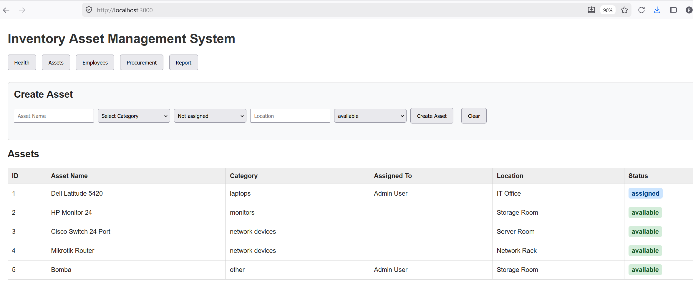
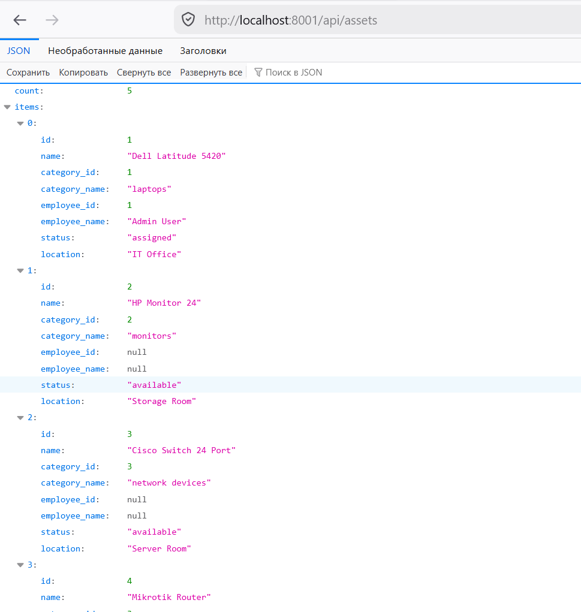
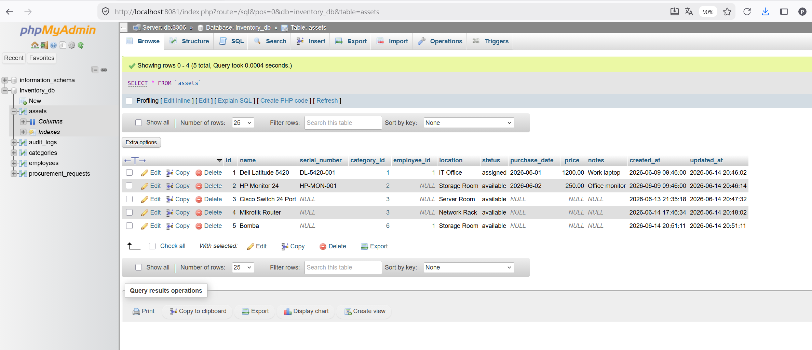
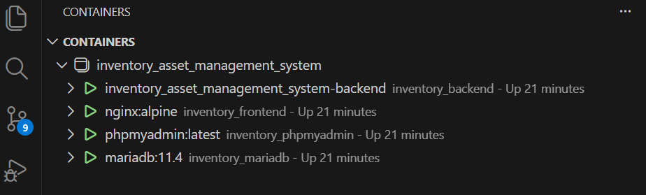
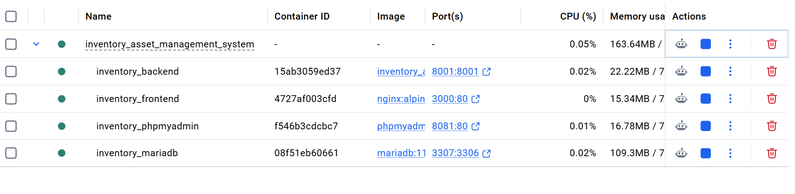

# Inventory and Asset Management System

## 1. Project Overview

The **Inventory and Asset Management System** is a web-based application for managing company assets, employees, categories, procurement requests, and reports.

The system is designed as a small enterprise-style application with a relational database, REST-style backend API, frontend interface, audit logging concept, and Docker-based deployment.

The main goal of the project is to track company equipment from registration to assignment, availability, procurement, and reporting.

---

## 2. Main Features

### Asset Management

The system allows users to manage company assets such as laptops, monitors, network devices, office equipment, and other company resources.

Each asset contains:

- Asset name
- Serial number
- Category
- Assigned employee
- Location
- Status
- Purchase date
- Price
- Notes

Example statuses:

- available
- assigned
- maintenance
- retired

---

### Employee Management

Employees can be stored in the system and linked to assigned assets.

Each employee contains:

- Employee ID
- Full name
- Department
- Email

This makes it possible to see which employee is responsible for each asset.

---

### Category Management

Assets are grouped by categories.

Examples:

- laptops
- monitors
- network devices
- office equipment
- other

Categories help organize the inventory and simplify filtering and reporting.

---

### Procurement Workflow

The procurement module is used to register requests for new equipment.

A procurement request may include:

- Requested item name
- Category
- Requester
- Quantity
- Status
- Creation date

Example request statuses:

- pending
- approved
- rejected
- completed

---

### Reports

The reporting module provides summarized information about the inventory.

Examples of useful reports:

- Total number of assets
- Available assets
- Assigned assets
- Assets by category
- Assets by employee
- Procurement request statistics

---

### Audit Logging

Important actions can be recorded in the audit log.

Examples:

- Asset created
- Asset updated
- Asset assigned
- Procurement request created
- Procurement status changed

Audit logging helps track system activity and improves reliability.

---

## 3. Project Architecture

The project uses a modular structure.

```text
Inventory_Asset_Management_System
│
├── app
│   ├── main.py
│   ├── api
│   │   ├── assets_api.py
│   │   ├── employees_api.py
│   │   ├── procurement_api.py
│   │   └── reports_api.py
│   │
│   ├── config
│   │   ├── db_config.py
│   │   └── settings.py
│   │
│   ├── models
│   │   ├── asset.py
│   │   ├── category.py
│   │   ├── employee.py
│   │   └── procurement_request.py
│   │
│   ├── repositories
│   │   ├── asset_repository.py
│   │   ├── audit_repository.py
│   │   ├── database.py
│   │   ├── employee_repository.py
│   │   └── procurement_repository.py
│   │
│   └── services
│       ├── asset_service.py
│       ├── audit_service.py
│       ├── employee_service.py
│       ├── procurement_service.py
│       └── report_service.py
│
├── db
│   └── schema.sql
│
├── docs
│   ├── project_documentation.md
│   └── screenshots
│       ├── api_assets.png
│       ├── database_assets_table.png
│       ├── docker_containers_ports.png
│       ├── docker_containers_vscode.png
│       └── frontend_assets.png
│
├── frontend
│   ├── index.html
│   ├── css
│   │   └── style.css
│   └── js
│
├── docker-compose.yml
├── Dockerfile
├── requirements.txt
├── .env
└── README.md
```

---

## 4. Technology Stack

### Backend

- Python
- Custom HTTP API structure
- mysql-connector-python
- python-dotenv

### Database

- MariaDB 11.4

### Frontend

- HTML
- CSS
- JavaScript
- Nginx container for serving static files

### DevOps and Deployment

- Docker
- Docker Compose
- phpMyAdmin for database inspection

---

## 5. Docker Services

The system runs with Docker Compose and contains several containers.

| Service | Container Name | Port Mapping | Purpose |
|---|---|---|---|
| MariaDB | `inventory_mariadb` | `3307:3306` | Stores application data |
| Backend | `inventory_backend` | `8001:8001` | Provides API endpoints |
| Frontend | `inventory_frontend` | `3000:80` | Serves the web interface |
| phpMyAdmin | `inventory_phpmyadmin` | `8081:80` | Provides database inspection UI |

---

### MariaDB

Container name:

```text
inventory_mariadb
```

Port mapping:

```text
3307:3306
```

Purpose:

- Stores all application data
- Contains assets, employees, categories, procurement requests, and audit logs

---

### Backend

Container name:

```text
inventory_backend
```

Port mapping:

```text
8001:8001
```

Purpose:

- Provides REST-style API endpoints
- Connects frontend with the database
- Handles business logic through services and repositories

---

### Frontend

Container name:

```text
inventory_frontend
```

Port mapping:

```text
3000:80
```

Purpose:

- Serves the web interface
- Allows the user to view and manage assets from the browser

---

### phpMyAdmin

Container name:

```text
inventory_phpmyadmin
```

Port mapping:

```text
8081:80
```

Purpose:

- Provides a graphical interface for inspecting and managing the MariaDB database

---

## 6. Database Structure

The database contains the following main tables:

```text
assets
categories
employees
procurement_requests
audit_logs
```

---

### assets

Stores company assets.

Main fields:

- id
- name
- serial_number
- category_id
- employee_id
- location
- status
- purchase_date
- price
- notes
- created_at
- updated_at

---

### categories

Stores asset categories.

Main fields:

- id
- name

---

### employees

Stores employee data.

Main fields:

- id
- full_name
- department
- email

---

### procurement_requests

Stores equipment purchase requests.

Main fields:

- id
- item_name
- category_id
- requester_id
- quantity
- status
- created_at

---

### audit_logs

Stores system activity logs.

Main fields:

- id
- action
- entity_type
- entity_id
- created_at

---

## 7. API Endpoints

### Assets API

Base path:

```text
/api/assets
```

Example request:

```text
GET http://localhost:8001/api/assets
```

Example response:

```json
{
  "count": 5,
  "items": [
    {
      "id": 1,
      "name": "Dell Latitude 5420",
      "category_id": 1,
      "category_name": "laptops",
      "employee_id": 1,
      "employee_name": "Admin User",
      "location": "IT Office",
      "status": "assigned"
    },
    {
      "id": 2,
      "name": "HP Monitor 24",
      "category_id": 2,
      "category_name": "monitors",
      "employee_id": null,
      "employee_name": null,
      "location": "Storage Room",
      "status": "available"
    },
    {
      "id": 3,
      "name": "Cisco Switch 24 Port",
      "category_id": 3,
      "category_name": "network devices",
      "employee_id": null,
      "employee_name": null,
      "location": "Server Room",
      "status": "available"
    },
    {
      "id": 4,
      "name": "Mikrotik Router",
      "category_id": 3,
      "category_name": "network devices",
      "employee_id": null,
      "employee_name": null,
      "location": "Network Rack",
      "status": "available"
    },
    {
      "id": 5,
      "name": "Bomba",
      "category_id": 6,
      "category_name": "other",
      "employee_id": 1,
      "employee_name": "Admin User",
      "location": "Storage Room",
      "status": "available"
    }
  ]
}
```

---

### Employees API

Base path:

```text
/api/employees
```

Purpose:

- View employees
- Add employees
- Use employees when assigning assets

---

### Procurement API

Base path:

```text
/api/procurement
```

Purpose:

- Create procurement requests
- View existing requests
- Update request statuses

---

### Reports API

Base path:

```text
/api/reports
```

Purpose:

- Show inventory statistics
- Show asset distribution
- Show procurement summaries

---

## 8. Application Layers

The project is divided into several logical layers.

### API Layer

Location:

```text
app\api
```

Responsibility:

- Receive HTTP requests
- Parse request data
- Call service functions
- Return JSON responses

---

### Service Layer

Location:

```text
app\services
```

Responsibility:

- Contains business logic
- Validates operations
- Coordinates repositories
- Calls audit logging when needed

---

### Repository Layer

Location:

```text
app\repositories
```

Responsibility:

- Works directly with the database
- Executes SQL queries
- Converts database rows into Python dictionaries or models

---

### Model Layer

Location:

```text
app\models
```

Responsibility:

- Describes main project entities
- Keeps the project structure clean and understandable

---

### Configuration Layer

Location:

```text
app\config
```

Responsibility:

- Loads environment variables
- Stores database connection settings
- Keeps configuration separated from application logic

---

## 9. Environment Configuration

The project uses a `.env` file for configuration.

Example:

```env
DB_HOST=inventory_mariadb
DB_PORT=3306
DB_NAME=inventory_db
DB_USER=inventory_user
DB_PASSWORD=inventory_pass
BACKEND_PORT=8001
```

The backend reads these values and uses them to connect to MariaDB.

---

## 10. How to Run the Project

From the project root folder:

```text
E:\Devops_2079_04Aug2025\CourseLessons\Lesson_081_09Jun2026\LessonFiles\Inventory_Asset_Management_System
```

Run:

```powershell
docker compose up -d --build
```

Check running containers:

```powershell
docker ps
```

Open the frontend:

```text
http://localhost:3000
```

Open the backend API:

```text
http://localhost:8001/api/assets
```

Open phpMyAdmin:

```text
http://localhost:8081
```

---

## 11. Database Initialization

If the database schema needs to be loaded manually, run this command from the project root folder:

```powershell
Get-Content .\db\schema.sql | docker exec -i inventory_mariadb mariadb -u inventory_user -pinventory_pass inventory_db
```

This command imports the SQL schema into the MariaDB container.

---

## 12. Example Test

To test the Assets API, open in the browser:

```text
http://localhost:8001/api/assets
```

Expected example result:

```text
The API should return JSON with the total asset count and the asset records.
```

Example:

```json
{
  "count": 5,
  "items": [
    {
      "id": 1,
      "name": "Dell Latitude 5420",
      "category_name": "laptops",
      "employee_name": "Admin User",
      "location": "IT Office",
      "status": "assigned"
    },
    {
      "id": 2,
      "name": "HP Monitor 24",
      "category_name": "monitors",
      "employee_name": null,
      "location": "Storage Room",
      "status": "available"
    }
  ]
}
```

---

## 13. Current Project Status

Implemented:

- Project folder structure
- Docker Compose configuration
- MariaDB container
- Backend container
- Frontend container
- phpMyAdmin container
- Database schema
- Assets API
- Initial test data
- Basic asset listing
- Frontend asset table
- Asset creation form
- Database inspection through phpMyAdmin

In progress:

- Employee management improvements
- Procurement workflow
- Reports page
- Better validation
- More complete audit logging

---

## 14. Future Improvements

Possible improvements:

- Add authentication
- Add user roles
- Add asset search and filters
- Add asset edit form
- Add asset delete/archive option
- Add CSV export
- Add PDF reports
- Add dashboard charts
- Add automated tests
- Add CI/CD pipeline
- Add backup and restore scripts

---

## 15. Screenshots

Project screenshots are stored in:

```text
docs\screenshots
```

Recommended screenshots:

```text
docker_containers_vscode.png
docker_containers_ports.png
api_assets.png
database_assets_table.png
frontend_assets.png
```

### Screenshot Description

| Screenshot | Description |
|---|---|
| `docker_containers_vscode.png` | Shows running Docker containers in VS Code |
| `docker_containers_ports.png` | Shows running containers and exposed ports in Docker Desktop |
| `api_assets.png` | Shows the backend Assets API response |
| `database_assets_table.png` | Shows the `assets` table in phpMyAdmin |
| `frontend_assets.png` | Shows the frontend Assets page |

### Screenshot Preview

Frontend:



Backend API:



Database table:



Docker containers:



Docker containers and ports:



---

## 16. Demo Scenario

This section describes a simple demonstration flow for the project.

### Step 1: Start the system

Run Docker Compose from the project root folder:

```powershell
docker compose up -d --build
```

After startup, the following containers should be running:

```text
inventory_mariadb
inventory_backend
inventory_frontend
inventory_phpmyadmin
```

---

### Step 2: Open the frontend

Open the frontend in the browser:

```text
http://localhost:3000
```

The user should see the main web interface of the Inventory and Asset Management System.

---

### Step 3: Check the Assets API

Open the Assets API endpoint:

```text
http://localhost:8001/api/assets
```

The endpoint should return a JSON response with asset records.

---

### Step 4: Open phpMyAdmin

Open phpMyAdmin:

```text
http://localhost:8081
```

The database should contain the following tables:

```text
assets
categories
employees
procurement_requests
audit_logs
```

---

## 17. Manual Testing Checklist

### Docker

- [ ] Docker Compose starts without errors
- [ ] MariaDB container is running
- [ ] Backend container is running
- [ ] Frontend container is running
- [ ] phpMyAdmin container is running

### Backend API

- [ ] `/api/assets` returns JSON
- [ ] Assets response contains `count`
- [ ] Assets response contains `items`
- [ ] Asset records contain id, name, category, employee, status, and location fields

### Database

- [ ] Database connection works
- [ ] Schema is imported successfully
- [ ] Test data exists in the database
- [ ] Assets table contains sample assets
- [ ] Categories table contains sample categories
- [ ] Employees table contains sample employees

### Frontend

- [ ] Frontend opens at `http://localhost:3000`
- [ ] Assets are displayed in the browser
- [ ] Asset form is visible
- [ ] Asset table layout is readable

---

## 18. Troubleshooting

### Backend does not start

Check backend logs:

```powershell
docker logs inventory_backend
```

Possible reasons:

- Missing Python package
- Wrong database connection settings
- MariaDB container is not ready yet
- Incorrect `.env` values

---

### Database connection error

Check if MariaDB is running:

```powershell
docker ps
```

Check MariaDB logs:

```powershell
docker logs inventory_mariadb
```

Verify that `.env` contains correct values:

```env
DB_HOST=inventory_mariadb
DB_PORT=3306
DB_NAME=inventory_db
DB_USER=inventory_user
DB_PASSWORD=inventory_pass
```

Inside Docker Compose, the backend should connect to MariaDB by container name:

```text
inventory_mariadb
```

The backend should not use `localhost` for the database connection inside Docker.

---

### API returns empty list

If the API returns:

```json
{
  "count": 0,
  "items": []
}
```

Possible reasons:

- Database schema exists, but test data was not inserted
- The wrong database is being used
- The backend is connected to a different MariaDB instance

Reload the schema manually:

```powershell
Get-Content .\db\schema.sql | docker exec -i inventory_mariadb mariadb -u inventory_user -pinventory_pass inventory_db
```

---

### Frontend does not show data

Check that the backend API works first:

```text
http://localhost:8001/api/assets
```

If the API works but the frontend does not show data, possible reasons are:

- Wrong API URL in JavaScript
- Browser cache
- Frontend container was not rebuilt
- JavaScript error in the browser console

---

## 19. Project Limitations

The current version is a learning project and does not yet include all enterprise features.

Current limitations:

- No authentication
- No user roles
- No advanced search
- No full CRUD interface for all entities
- No production-grade security configuration
- No automated test pipeline
- No backup and restore automation

These limitations are planned as possible future improvements.

---

## 20. Conclusion

The Inventory and Asset Management System demonstrates a practical enterprise-style application with backend, frontend, relational database, Docker deployment, and modular architecture.

The project is suitable as a final DevOps course project because it includes:

- Database design
- Backend API
- Frontend interface
- Docker-based deployment
- Environment configuration
- Multi-container architecture
- Basic enterprise workflow
- Audit and reporting concepts
